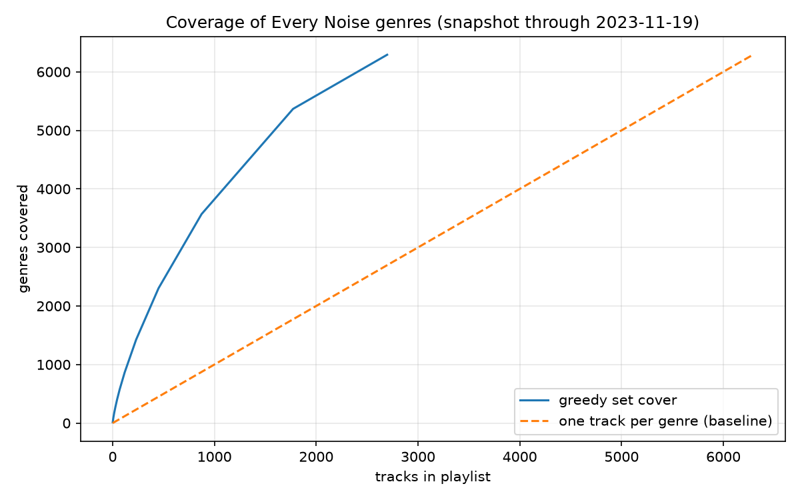

# Spotify Genre Quest

> One playlist. As many Spotify genres as possible.

**[Listen on Spotify](https://open.spotify.com/playlist/4VQMKxI0vTatxo5d1oWmD0)** · 2,703 tracks · 6,291 genres · ~158 h

## Why

Spotify Wrapped tells you how many genres you listened to, but not how those genres
are defined, and not how many exist. This project started as a half-joke challenge
("listen to every genre Spotify knows") and turned into an exercise in data collection,
combinatorial optimization and playlist design.

Spotify tags *artists*, not tracks, with thousands of fine-grained micro-genres
(shoegaze, nu metal, escape room, ...). Instead of picking one track per genre, this
project treats the problem as **set cover**: find a small set of artists whose genres
together cover the whole genre list, then order the tracks so the playlist flows
logically through genre space.

## Result

| | Tracks | Listening time* |
|---|---|---|
| One track per genre (baseline) | 6,291 | ~367 h |
| This playlist (greedy set cover) | 2,703 | ~158 h |

\*Assuming 3.5 minutes per track (the data has no track durations).

All 6,291 genres of the snapshot are covered by 2,703 tracks: 43% of the baseline,
roughly 6.6 days of listening instead of 15. About a third of the picks add only a single
new genre; that is the long tail. Coverage is measured against Every Noise's per-genre
artist rankings, not against Spotify's internal tags (see [Limitations](#limitations)).



## How it works

1. `fetch_genres.py` parses the Every Noise at Once genre map: 6,291 genres with name, map
   position and an example track.
2. `fetch_artists.py` visits each genre page once and stores its ranked artists (Spotify
   artist ID, example track ID) in a local SQLite database: ~481k artists, ~632k
   genre-artist links.
3. `set_cover.py` runs a greedy set cover: repeatedly pick the artist who adds the most
   still-uncovered genres (ties are broken by prominence in the genre rankings).
4. `order.py` places each artist at the centroid of their genres on the map and orders the
   playlist with a nearest-neighbour path, so neighbouring tracks sound alike. The resulting
   path is roughly 1-2% of the length of a random order.
5. `check_availability.py` looks up example tracks in the Spotify API to exclude those that
   are unavailable in Poland. Only the first ~600 tracks were verified before hitting the API
   quota (see below).
6. `build_playlist.py` creates the playlist on the Spotify account.

## Findings about the Spotify Web API (Development Mode, 2026)

- The artist object no longer includes `genres`, so genres cannot be read from the API.
- `recommendations/available-genre-seeds` and artist top tracks are unavailable.
- Search returns at most 10 results per request.
- Development Mode applies a request quota on top of the usual rate limit: roughly 650
  single-track lookups in a row triggered a ~24 h cooldown (HTTP 429). The pipeline is
  therefore mostly offline (scraping and set cover in SQLite) and uses the API only for the
  final playlist.
- Of the ~600 example tracks that were checked, 16 (2.7%) were unavailable in Poland.
- Every Noise at Once exposes Spotify artist and example-track IDs for each genre, which
  were verified against the API: artist and track lookups work.

## Limitations

- The genre list is a snapshot of Every Noise at Once through 2023-11-19; Spotify's taxonomy
  keeps changing, so coverage against today's genres is approximate.
- "Covered" means that an artist from the genre's ranked list is in the playlist. The lists
  are rankings (about a hundred artists per genre), not full tag sets, so this does not
  guarantee that Spotify currently tags the track with that genre, or that it shows up in
  Wrapped.
- Artists without an example track in the snapshot (~24k of ~481k) and 16 artists whose
  example tracks were unavailable in Poland were excluded.
- Availability was verified for only ~600 of the 2,703 tracks, so some tracks may be greyed
  out in the Spotify app.
- Greedy set cover is not guaranteed to be optimal (worst case about 3.3x the optimum, given
  the largest set of 15 genres), and the nearest-neighbour ordering is a heuristic.
- The availability check is specific to the Polish market.

## Reproducing

Requirements: Python 3.10+, a Spotify Premium account (needed to own a Development Mode
app), and an app registered in the Spotify Developer Dashboard with the redirect URI
`http://127.0.0.1:8888/callback` and your account added under User Management.

```bash
pip install -r requirements.txt
cp .env.example .env            # fill in the client ID and secret

python src/fetch_genres.py
python src/fetch_artists.py     # see the note below
python src/set_cover.py
python src/order.py
python src/build_playlist.py --name "Genre Quest"
```

`fetch_artists.py` fetches ~6,300 pages. The site's `robots.txt` disallows crawling; I asked
the author and received permission for a single, slow scan. If you want to reproduce this
step, please ask him first.

## Roadmap

- [x] Check which Spotify API endpoints still work in Development Mode
- [x] Genre map and per-genre artist collection
- [x] Set-cover selection and coverage curve
- [x] Ordering along the genre map
- [x] Playlist generation
- [ ] Progress tracker: match the listening history against the playlist and report which
      genres have been reached
- [ ] Verify availability of the remaining tracks and replace greyed-out ones
- [ ] Better ordering (2-opt) and an exact solution (ILP) to measure the greedy gap

## Disclaimer

This is an unofficial hobby project and is not affiliated with or endorsed by Spotify.
No Spotify or Every Noise data is redistributed in this repository.

## Acknowledgements

Genre data comes from [Every Noise at Once](https://everynoise.com/) by Glenn McDonald:
a snapshot of Spotify's genre taxonomy through 2023-11-19. The genre pages were fetched once,
at roughly one request per second, with his permission. This project is not affiliated with
him or with Spotify.

## License

MIT, see [LICENSE](LICENSE). The license covers the code only.